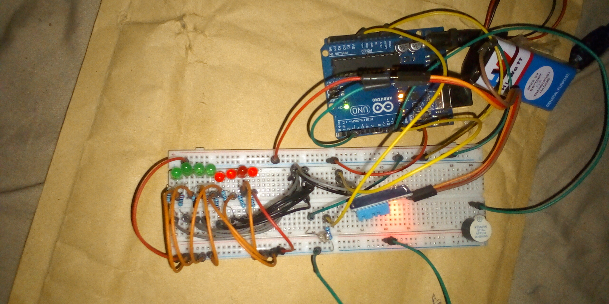

# Smart Environment Temperature & Light Monitoring System – Arduino Project

## Overview
This project is about a smart environment system using Arduino.
I used a DHT11 temperature sensor to check the temperature and a photoresistor (LDR) to measure light.
The system alerts with LED and buzzer when temperature is too high and automatically controls the LED based on the light level.

## Objective
- Learn how to interface a DHT11 temperature sensor with Arduino
- Read and process analog sensor data from a photoresistor
- Implement conditional alerts using LEDs and a buzzer
- Monitor environmental data using the Serial Monitor
- Combine multiple sensors in a single smart system

## Components Used
- Arduino Uno
- DHT11 Temperature Sensor
- Photoresistor (LDR)
- LED
- Buzzer
- 220Ω resistors
- Breadboard
- Jumper wires
- 9V Battery
- 9V Battery Clip to DC Barrel Jack

## Circuit Diagram

## How It Works
1. The DHT11 sensor measures the ambient temperature of the environment.
2. The photoresistor detects the surrounding light intensity.
3. Temperature and light readings are printed to the Serial Monitor for monitoring.
4. If the temperature rises above 38°C:
   - The buzzer is activated.
   - The LED blinks multiple times as a warning indicator.
5. If the ambient light level is low:
   - The LED turns ON automatically.
6. If sufficient light is detected:
   - The LED turns OFF to conserve power.
7. The system continuously updates sensor readings in real time.

## Code
The Arduino sketch for this project is located in the [code/ directory](code/Environment_temp_smart_sensor_project_on_23rd_october_2025.ino).

## Demo Video
A demonstration video showing the working project is included in this repository.

📹 **Project Demonstration:**  
[Click here to watch/download the demo video](video/)

*(If the video does not preview directly on GitHub, please download it using the link above.)*

## Reflection (What I Learned)
- Interfacing temperature sensors using Arduino libraries
- Reading and interpreting analog sensor values
- Implementing alert systems using LEDs and buzzers
- Designing basic smart environment monitoring systems

## Challenges Faced
- Handling sensor read errors from the DHT11
- Selecting accurate threshold values for alerts
- Coordinating multiple sensor conditions effectively

## Possible Improvements
- Add humidity monitoring using the DHT11 sensor
- Display readings on an LCD or OLED screen
- Replace delay-based logic with non-blocking timing
- Send alerts wirelessly using Bluetooth or Wi-Fi

	
## Project Status
Completed
